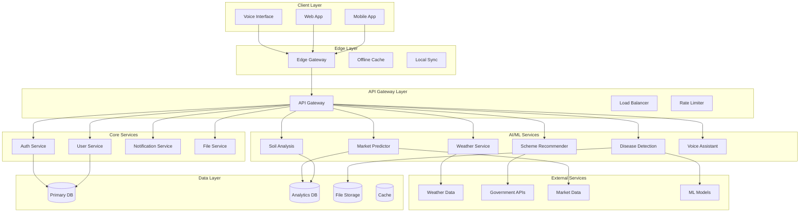
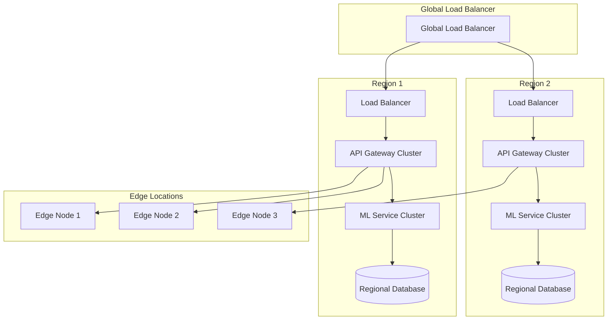

# Design Document

## Overview

The Rural AI Platform is designed as a cloud-native, microservices-based system that provides AI-powered agricultural intelligence to rural communities. The platform emphasizes offline-first capabilities, multilingual support, and scalable AI/ML services to bridge the digital divide in rural areas.

The system architecture prioritizes resilience, accessibility, and performance optimization for low-bandwidth environments while maintaining enterprise-grade security and compliance standards.

## Architecture

### High-Level System Architecture

The platform follows a distributed microservices architecture with edge computing capabilities:



### Architecture Style

**Microservices Architecture with Edge Computing**

The platform adopts a microservices architecture for the following benefits:
- **Scalability**: Individual services can scale based on demand
- **Resilience**: Service failures don't cascade across the system
- **Technology Diversity**: Different services can use optimal technology stacks
- **Team Autonomy**: Independent development and deployment cycles
- **Rural Optimization**: Edge services provide offline capabilities

**Edge-First Design**: Critical for rural deployment where connectivity is intermittent. Edge nodes cache essential data and provide core functionality offline.

## Components and Interfaces

### Frontend Components

**Mobile Application (React Native/Flutter)**
- Cross-platform mobile app for Android/iOS
- Offline-first architecture with local SQLite database
- Camera integration for crop image capture
- Voice recording and playback capabilities
- Push notification support
- Biometric authentication integration

**Web Application (React/Vue.js)**
- Progressive Web App (PWA) for desktop access
- Responsive design for various screen sizes
- Administrative dashboards for experts and government officers
- Real-time analytics and reporting interfaces
- Bulk data upload capabilities

**Voice Interface Module**
- Speech-to-text processing for regional languages
- Natural language understanding for agricultural queries
- Text-to-speech synthesis with local accent support
- Noise cancellation for rural environments
- Offline voice processing capabilities

### Backend Services

**User Service**
```typescript
interface UserService {
  createUser(userData: UserProfile): Promise<User>
  updateProfile(userId: string, updates: ProfileUpdate): Promise<User>
  getUserByLocation(coordinates: GeoLocation): Promise<User[]>
  validateFarmerCredentials(credentials: FarmerCredentials): Promise<boolean>
}

interface UserProfile {
  personalInfo: PersonalDetails
  farmDetails: FarmInformation
  cropPreferences: CropType[]
  languagePreference: LanguageCode
  deviceCapabilities: DeviceSpecs
}
```

**Authentication Service**
```typescript
interface AuthService {
  authenticateUser(credentials: LoginCredentials): Promise<AuthToken>
  refreshToken(token: RefreshToken): Promise<AuthToken>
  validatePermissions(userId: string, resource: string): Promise<boolean>
  enableMFA(userId: string, method: MFAMethod): Promise<MFASetup>
}
```

**Notification Service**
```typescript
interface NotificationService {
  sendWeatherAlert(userId: string, alert: WeatherAlert): Promise<void>
  sendSchemeNotification(userId: string, scheme: GovernmentScheme): Promise<void>
  scheduleReminder(userId: string, reminder: FarmingReminder): Promise<void>
  sendBulkNotification(userIds: string[], message: Notification): Promise<void>
}
```

### AI/ML Components

**Disease Detection Module**
```typescript
interface DiseaseDetectionService {
  analyzeImage(image: ImageData, cropType: CropType): Promise<DiseaseAnalysis>
  getConfidenceScore(analysis: DiseaseAnalysis): number
  getTreatmentRecommendations(disease: Disease): Promise<Treatment[]>
  updateModel(trainingData: LabeledImageSet): Promise<ModelVersion>
}

interface DiseaseAnalysis {
  detectedDiseases: Disease[]
  confidenceScores: number[]
  affectedAreas: BoundingBox[]
  severity: SeverityLevel
  recommendations: TreatmentPlan
}
```

**Weather Advisory Service**
```typescript
interface WeatherAdvisoryService {
  getForecast(location: GeoLocation, days: number): Promise<WeatherForecast>
  generateAdvisory(weather: WeatherData, cropType: CropType): Promise<FarmingAdvisory>
  getSeasonalRecommendations(location: GeoLocation): Promise<SeasonalPlan>
  alertSevereWeather(location: GeoLocation): Promise<WeatherAlert[]>
}
```

**Soil Analysis Engine**
```typescript
interface SoilAnalysisService {
  analyzeSoilData(data: SoilSensorData | SoilImage): Promise<SoilHealthReport>
  recommendFertilizers(soilHealth: SoilHealthReport): Promise<FertilizerPlan>
  trackSoilImprovement(farmId: string, timeRange: DateRange): Promise<ImprovementMetrics>
  generateSoilMap(farmBoundary: GeoPolygon): Promise<SoilMap>
}
```

**Scheme Recommendation Engine**
```typescript
interface SchemeRecommendationService {
  findEligibleSchemes(farmerProfile: FarmerProfile): Promise<GovernmentScheme[]>
  calculateEligibilityScore(farmer: FarmerProfile, scheme: GovernmentScheme): number
  getApplicationGuidance(scheme: GovernmentScheme): Promise<ApplicationGuide>
  trackApplicationStatus(applicationId: string): Promise<ApplicationStatus>
}
```

**Market Prediction System**
```typescript
interface MarketPredictionService {
  predictPrices(crop: CropType, location: GeoLocation, timeframe: number): Promise<PriceForecast>
  getMarketTrends(crop: CropType, region: Region): Promise<MarketTrend>
  recommendSellingTime(crop: CropType, quantity: number): Promise<SellingRecommendation>
  analyzeSupplyDemand(crop: CropType, region: Region): Promise<SupplyDemandAnalysis>
}
```

**Voice Assistant Module**
```typescript
interface VoiceAssistantService {
  processVoiceQuery(audio: AudioData, language: LanguageCode): Promise<QueryResponse>
  synthesizeSpeech(text: string, language: LanguageCode): Promise<AudioData>
  trainLanguageModel(trainingData: VoiceDataset): Promise<ModelVersion>
  detectIntent(query: string, context: ConversationContext): Promise<Intent>
}
```

## Data Models

### Core Data Structures

**User and Farm Data**
```typescript
interface User {
  id: string
  personalInfo: {
    name: string
    phoneNumber: string
    email?: string
    dateOfBirth: Date
    gender: Gender
    education: EducationLevel
  }
  farmDetails: {
    farmId: string
    location: GeoLocation
    totalArea: number
    soilType: SoilType
    irrigationType: IrrigationType
    crops: CropDetails[]
  }
  preferences: {
    language: LanguageCode
    notificationSettings: NotificationPreferences
    privacySettings: PrivacySettings
  }
  deviceInfo: {
    deviceId: string
    platform: Platform
    capabilities: DeviceCapabilities
  }
}

interface CropDetails {
  cropType: CropType
  variety: string
  plantingDate: Date
  expectedHarvest: Date
  area: number
  currentStage: GrowthStage
}
```

**AI Analysis Results**
```typescript
interface DiseaseDetectionResult {
  id: string
  farmerId: string
  imageUrl: string
  timestamp: Date
  cropType: CropType
  detectedDiseases: {
    disease: Disease
    confidence: number
    severity: SeverityLevel
    affectedArea: number
  }[]
  recommendations: TreatmentRecommendation[]
  followUpRequired: boolean
}

interface SoilAnalysisResult {
  id: string
  farmerId: string
  location: GeoLocation
  timestamp: Date
  analysisType: 'sensor' | 'image' | 'manual'
  metrics: {
    ph: number
    nitrogen: number
    phosphorus: number
    potassium: number
    organicMatter: number
    moisture: number
  }
  recommendations: SoilImprovement[]
  nextTestDate: Date
}
```

**Market and Weather Data**
```typescript
interface MarketData {
  id: string
  crop: CropType
  location: GeoLocation
  date: Date
  prices: {
    wholesale: number
    retail: number
    farmGate: number
  }
  volume: number
  quality: QualityGrade
  source: DataSource
}

interface WeatherData {
  location: GeoLocation
  timestamp: Date
  current: {
    temperature: number
    humidity: number
    rainfall: number
    windSpeed: number
    pressure: number
  }
  forecast: WeatherForecast[]
  alerts: WeatherAlert[]
}
```

## Correctness Properties

*A property is a characteristic or behavior that should hold true across all valid executions of a system—essentially, a formal statement about what the system should do. Properties serve as the bridge between human-readable specifications and machine-verifiable correctness guarantees.*

<function_calls>
<invoke name="prework">
<parameter name="featureName">rural-ai-platform

Based on the prework analysis, the following correctness properties ensure the system meets all functional requirements:

**Property 1: Response Time Performance**
*For any* system request (image analysis, weather advisory, soil analysis, scheme matching), the response time should not exceed the specified limit for that service type (10 seconds for disease detection, 1 hour for weather advisory, 5 minutes for soil analysis, 2 minutes for scheme matching)
**Validates: Requirements 1.1, 2.1, 3.1, 4.1**

**Property 2: AI Confidence Thresholds**
*For any* AI-generated recommendation (disease treatment, market prediction), the confidence score should meet or exceed the minimum threshold (80% for disease detection, 75% for market predictions)
**Validates: Requirements 1.2, 5.2**

**Property 3: Error Handling and Recovery**
*For any* invalid input (poor image quality, incomplete data, background noise), the system should provide specific guidance for correction rather than generic error messages
**Validates: Requirements 1.3, 7.4**

**Property 4: Data Completeness Requirements**
*For any* system analysis (disease detection, soil analysis, scheme matching, expert profiles), all required data fields should be present and validated before processing
**Validates: Requirements 1.4, 3.2, 4.2, 4.4, 9.2, 10.2**

**Property 5: Ranking and Prioritization**
*For any* multi-result response (multiple diseases, scheme recommendations, market risks), results should be properly ordered by relevance, severity, or priority
**Validates: Requirements 1.5, 5.3, 8.5**

**Property 6: Forecast Duration Consistency**
*For any* time-based prediction (weather forecast, market prices, historical analysis), the system should provide data for the full requested duration (7 days for weather, 30 days for prices, 5 years for historical)
**Validates: Requirements 2.3, 5.1, 5.5**

**Property 7: Alert Timing Requirements**
*For any* critical notification (severe weather, new schemes, expert consultations), the system should deliver alerts within the specified timeframe (24 hours for weather, 24 hours for schemes, 2 hours for consultations)
**Validates: Requirements 2.2, 4.3, 10.1**

**Property 8: Automatic Update Propagation**
*For any* data change (weather updates, scheme criteria, soil conditions), dependent recommendations should be automatically recalculated and updated
**Validates: Requirements 2.4, 3.5, 4.5**

**Property 9: Integration Completeness**
*For any* external data source integration (weather APIs, government schemes, market data), the system should successfully connect and retrieve required data
**Validates: Requirements 2.5, 5.4**

**Property 10: Input Method Flexibility**
*For any* data input requirement (soil analysis, voice queries, consultation modes), the system should support all specified input methods and process them correctly
**Validates: Requirements 3.4, 7.2, 10.4**

**Property 11: Recommendation Comprehensiveness**
*For any* identified issue (soil deficiency, high pesticide use, carbon footprint), the system should provide specific, actionable recommendations
**Validates: Requirements 3.3, 6.2, 6.4**

**Property 12: Sustainable Practice Promotion**
*For any* farming recommendation (crop rotation, water usage, biodiversity), the system should incorporate sustainability principles and environmental considerations
**Validates: Requirements 6.1, 6.3, 6.5**

**Property 13: Language and Accessibility Support**
*For any* user interaction (voice queries, text responses, agricultural terminology), the system should handle regional languages and dialects with specified accuracy levels
**Validates: Requirements 7.1, 7.3, 7.5**

**Property 14: Offline Functionality Preservation**
*For any* core feature (disease detection, cached data, sync operations), offline mode should maintain essential functionality and properly synchronize when connectivity returns
**Validates: Requirements 8.1, 8.2, 8.3, 8.4**

**Property 15: User Experience Consistency**
*For any* user registration or profile management, the system should require minimal information while collecting necessary data for personalization
**Validates: Requirements 9.1, 9.5**

**Property 16: Security and Compliance**
*For any* data modification or access request, the system should enforce role-based permissions and maintain complete audit trails
**Validates: Requirements 9.3, 9.4**

**Property 17: Expert System Integration**
*For any* consultation completion or conflicting advice scenario, the system should properly collect feedback, update ratings, and present multiple perspectives clearly
**Validates: Requirements 10.3, 10.5**

## Error Handling

### Error Classification and Response Strategy

**Input Validation Errors**
- Image quality insufficient for disease detection
- Incomplete farmer profile data
- Invalid sensor readings or corrupted data
- Unsupported file formats or data types

**System Integration Errors**
- Weather API unavailability or timeout
- Government scheme database connection failures
- Market data feed interruptions
- ML model inference failures

**Network and Connectivity Errors**
- Intermittent internet connectivity in rural areas
- Slow network speeds affecting real-time features
- Offline mode transitions and data synchronization conflicts
- Edge server communication failures

**User Experience Errors**
- Voice recognition failures due to background noise
- Language or dialect not properly recognized
- Device capability limitations (camera, microphone, storage)
- User authentication and session management issues

### Error Recovery Mechanisms

**Graceful Degradation**
```typescript
interface ErrorRecoveryStrategy {
  fallbackMode: 'offline' | 'cached' | 'simplified'
  retryPolicy: RetryConfiguration
  userNotification: UserFriendlyMessage
  dataPreservation: boolean
}

class ResilientService {
  async executeWithFallback<T>(
    primaryOperation: () => Promise<T>,
    fallbackOperation: () => Promise<T>,
    errorStrategy: ErrorRecoveryStrategy
  ): Promise<T> {
    try {
      return await this.withRetry(primaryOperation, errorStrategy.retryPolicy)
    } catch (error) {
      this.logError(error)
      this.notifyUser(errorStrategy.userNotification)
      return await fallbackOperation()
    }
  }
}
```

**Offline-First Error Handling**
- Cache critical data locally for offline access
- Queue failed operations for retry when connectivity returns
- Provide clear indicators of offline vs online functionality
- Maintain data consistency during sync operations

## Testing Strategy

### Dual Testing Approach

The Rural AI Platform requires both unit testing and property-based testing to ensure comprehensive coverage:

**Unit Testing Focus:**
- Specific API endpoint functionality
- Database operations and data integrity
- Authentication and authorization flows
- Integration points with external services
- Edge cases for rural connectivity scenarios
- Error handling for specific failure modes

**Property-Based Testing Focus:**
- Universal properties across all AI/ML predictions
- Data consistency across offline/online transitions
- Performance characteristics under varying loads
- Security properties across all user interactions
- Correctness of recommendation algorithms

### Property-Based Testing Configuration

**Testing Framework:** Hypothesis (Python) for backend services, fast-check (TypeScript) for frontend components

**Test Configuration:**
- Minimum 100 iterations per property test
- Custom generators for agricultural data (crops, weather, soil conditions)
- Shrinking strategies for complex failure scenarios
- Parallel execution for performance testing

**Property Test Examples:**
```python
# Example property test for disease detection
@given(crop_images(), crop_types())
def test_disease_detection_response_time(image, crop_type):
    """Feature: rural-ai-platform, Property 1: Response time performance"""
    start_time = time.time()
    result = disease_detection_service.analyze_image(image, crop_type)
    response_time = time.time() - start_time
    
    assert response_time <= 10.0  # 10 second requirement
    assert result.confidence_score >= 0.8  # 80% confidence requirement

@given(farmer_profiles(), government_schemes())
def test_scheme_recommendation_completeness(profile, schemes):
    """Feature: rural-ai-platform, Property 4: Data completeness requirements"""
    recommendations = scheme_engine.find_eligible_schemes(profile)
    
    for recommendation in recommendations:
        assert recommendation.application_guidance is not None
        assert len(recommendation.required_documents) > 0
        assert recommendation.eligibility_score >= 0.0
```

### Integration Testing Strategy

**End-to-End Scenarios:**
- Complete farmer journey from registration to harvest recommendations
- Offline-to-online synchronization workflows
- Multi-language voice interaction flows
- Expert consultation complete lifecycle
- Emergency weather alert propagation

**Performance Testing:**
- Load testing with 10,000 concurrent users
- Stress testing AI/ML inference under peak loads
- Network resilience testing with simulated rural connectivity
- Battery and resource usage optimization testing

**Security Testing:**
- Penetration testing for API endpoints
- Data privacy compliance validation
- Role-based access control verification
- Audit trail completeness testing

### Deployment and Infrastructure

**Cloud Architecture (AWS/Azure/GCP)**

**Core Infrastructure:**
```yaml
# Kubernetes deployment configuration
apiVersion: apps/v1
kind: Deployment
metadata:
  name: rural-ai-platform
spec:
  replicas: 3
  selector:
    matchLabels:
      app: rural-ai-platform
  template:
    metadata:
      labels:
        app: rural-ai-platform
    spec:
      containers:
      - name: api-gateway
        image: rural-ai/api-gateway:latest
        resources:
          requests:
            memory: "512Mi"
            cpu: "250m"
          limits:
            memory: "1Gi"
            cpu: "500m"
        env:
        - name: DATABASE_URL
          valueFrom:
            secretKeyRef:
              name: db-credentials
              key: url
```

**Edge Computing Strategy:**
- AWS IoT Greengrass or Azure IoT Edge for rural deployment
- Local caching of ML models for offline disease detection
- Data synchronization queues for intermittent connectivity
- Regional data centers for reduced latency

**Scalability Architecture:**


**Security Implementation:**

**Authentication and Authorization:**
```typescript
// JWT-based authentication with role-based access control
interface SecurityConfig {
  jwtSecret: string
  tokenExpiry: number
  mfaRequired: boolean
  rolePermissions: RolePermissionMap
}

class SecurityService {
  async authenticateUser(credentials: LoginCredentials): Promise<AuthResult> {
    const user = await this.validateCredentials(credentials)
    const token = this.generateJWT(user)
    const permissions = this.getRolePermissions(user.role)
    
    return {
      token,
      user: this.sanitizeUserData(user),
      permissions,
      expiresAt: new Date(Date.now() + this.config.tokenExpiry)
    }
  }
  
  async authorizeRequest(token: string, resource: string, action: string): Promise<boolean> {
    const payload = this.verifyJWT(token)
    const permissions = this.getRolePermissions(payload.role)
    return permissions.hasAccess(resource, action)
  }
}
```

**Data Encryption and Privacy:**
- AES-256 encryption for data at rest
- TLS 1.3 for data in transit
- Field-level encryption for sensitive farmer data
- GDPR/local privacy regulation compliance
- Data anonymization for analytics and ML training

**Monitoring and Observability:**
```typescript
// Comprehensive monitoring setup
interface MonitoringConfig {
  metrics: MetricsCollector
  logging: StructuredLogger
  tracing: DistributedTracing
  alerting: AlertManager
}

class PlatformMonitoring {
  trackUserJourney(userId: string, action: string, metadata: any) {
    this.metrics.increment('user.action', {
      action,
      userId: this.hashUserId(userId),
      region: metadata.region
    })
    
    this.logger.info('User action completed', {
      action,
      userId: this.hashUserId(userId),
      duration: metadata.duration,
      success: metadata.success
    })
  }
  
  trackAIPerformance(modelName: string, inferenceTime: number, accuracy: number) {
    this.metrics.histogram('ai.inference_time', inferenceTime, { model: modelName })
    this.metrics.gauge('ai.accuracy', accuracy, { model: modelName })
  }
}
```

This comprehensive design provides a robust, scalable, and accessible platform for rural agricultural innovation while maintaining high standards for performance, security, and user experience.